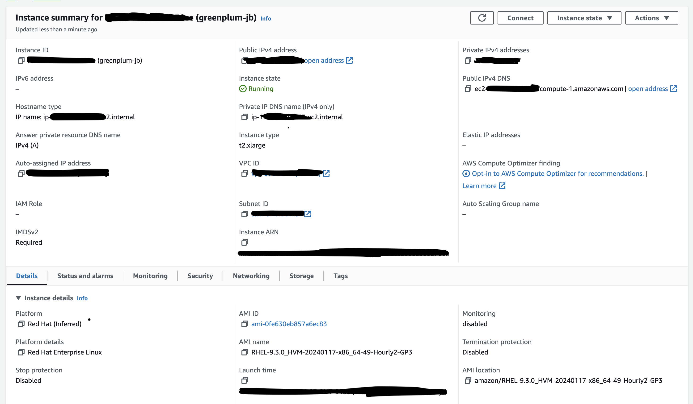
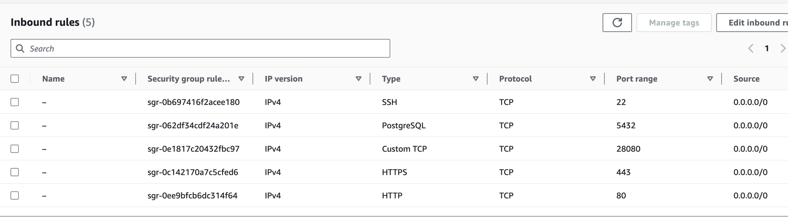

# Tanzu Greenplum(GP) Deployment Instructions
Tanzu Greenplum runs on x86 hardware with Linux. Following are the deployment steps of **Greenplum 7.x** single node on Linux.

## VM used for lab :
 - AWS ec2 instance **t2.xlarge (RAM 16 gb , vCPU 4 , Disk 50 gb)**
 - OS **Redhat Enterprise Linux 9**
 - Network Ports opened for external traffic SSH(22),Https (443) ,Http(80),Postgres DB on custom TCP protocol (5432) , Greenplum command center on custom TCP protocol (28080)

Refer to the below screen shots ,

Greenplum VM used in Lab


Greenplum VM networking rules/ports


## GP Deployment Steps
1. Login to your gp vm 
 ``` 
 #login to vm through ssh 
 ssh -i "<your .pem file>" <vm user>@<vm ip<>
 #Example - ssh -i "xxx-xx.pem" root@ec2-xxxxxxxx.compute-1.amazonaws.com

 ```
2. Install linux yum package manager and other gp required packages 
```
sudo dnf update
sudo dnf makecache
sudo dnf install openssh-server
sudo dnf install libcap
sudo dnf install vim
```
3. Download gp installer (rpm file)

You can download the Greenplum Database Server software package file (**greenplum-db-7.1.0-el9-x86_64.rpm**) from [VMware Tanzu Network](https://network.pivotal.io/products/vmware-greenplum) into your local machine or gp vm. 

**Note** : If gp rpm file downloaded in local machine , use `scp` command to transfer file to gp vm.

 `scp -i <your.pem file> greenplum-db-7.1.0-el9-x86_64.rpm <vm user>@<vm ip<>com:~/. `

4. Create gpadmin user in gp vm.
```
#login as root 
sudo su

# create gpadmin user
sudo groupadd gpadmin
sudo useradd -g gpadmin gpadmin
sudo passwd gpadmin  <enter gp admin password of your choice>

# To avoid entering password every time on gpadmin user , create a sudo file 
vi sudo

# add this line in sudo file
gpadmin ALL=(ALL) NOPASSWD: ALL
```
5. Configure your vm for gp system settings 

 * **Deactivate or Configure SELinux**
     ```
     # As the root user, check the status of SELinux:
     sestatus
     #output - SELinuxstatus: disabled
    ```
    If SELinux is not deactivated, deactivate it by editing the `/etc/selinux/config` file. As root, change the value of the `SELINUX` parameter in the `config` file as follows:
     ```
     SELINUX=disabled
    ```
 * **The sysctl.conf File**
    
    The `sysctl.conf` parameters listed in this topic are for performance, optimization, and consistency in a wide variety of environments. Change these settings according to your specific situation and setup.
     Set the parameters in the `/etc/sysctl.conf` file and reload with `sysctl -p`:
    ```
    # kernel.shmall = _PHYS_PAGES / 2 # See Shared Memory Pages
    kernel.shmall = 197951838
    # kernel.shmmax = kernel.shmall * PAGE_SIZE 
    kernel.shmmax = 810810728448
    kernel.shmmni = 4096
    vm.overcommit_memory = 2 # See Segment Host Memory
    vm.overcommit_ratio = 95 # See Segment Host Memory

    net.ipv4.ip_local_port_range = 10000 65535 # See Port Settings
    kernel.sem = 250 2048000 200 8192
    kernel.sysrq = 1
    kernel.core_uses_pid = 1
    kernel.msgmnb = 65536
    kernel.msgmax = 65536
    kernel.msgmni = 2048
    net.ipv4.tcp_syncookies = 1
    net.ipv4.conf.default.accept_source_route = 0
    net.ipv4.tcp_max_syn_backlog = 4096
    net.ipv4.conf.all.arp_filter = 1
    net.ipv4.ipfrag_high_thresh = 41943040
    net.ipv4.ipfrag_low_thresh = 31457280
    net.ipv4.ipfrag_time = 60
    net.core.netdev_max_backlog = 10000
    net.core.rmem_max = 2097152
    net.core.wmem_max = 2097152
    vm.swappiness = 10
    vm.zone_reclaim_mode = 0
    vm.dirty_expire_centisecs = 500
    vm.dirty_writeback_centisecs = 100
    vm.dirty_background_ratio = 0 # See System Memory
    vm.dirty_ratio = 0
    vm.dirty_background_bytes = 1610612736
    vm.dirty_bytes = 4294967296
    ```
6. Install greenplum with yum 
   ```
   #Copy gp rpm file to gpadmin home directory 
   cp greenplum-db-7.1.0-el9-x86_64.rpm /home/gpadmin/

   cd ..
   cd gpadmin/

   #Install gp with yum
   sudo yum install ./greenplum-db-7.1.0-el9-x86_64.rpm 

   #Change the owner and group of the installed files to gpadmin:
   sudo chown -R gpadmin:gpadmin /usr/local/greenplum*
   sudo chgrp -R gpadmin /usr/local/greenplum*

   ```
7. Enabling `gpadmin` Passwordless SSH
   ```
   #Login as root 
   sudo su

   #Update hosts file for adding ip as cdw 
   vi /etc/hosts
   #Add bolow line in hosts file and save it
   172.31.20.123 cdw
   
   #Run the gpssh-exkeys utility with your hostfile_exkeys file to enable n-n passwordless SSH for the gpadmin #user.
   gpssh-exkeys -h cdw
   
   ```
8. Creating Data Storage Areas on the Coordinator 
   ```
   #Login as root 
   sudo su
   
   #Create or choose a directory that will serve as your coordinator data storage area.
   mkdir -p /data/coordinator

   #Change ownership of this directory to the gpadmin user. 
   chown gpadmin:gpadmin /data/coordinator

   #Create or choose a directory that will serve as your primary data storage area. For single node only primary directory needed.
   mkdir -p /data/primary

   #Change ownership of this directory to the gpadmin user. 
   chown gpadmin:gpadmin /data/primary

   ```
9. Initializing a Greenplum Database System
   ```
   #Creating the Greenplum Database Configuration File -  to create the a gpinitsystem_config file Create gpconfig dir first 

   mkdir gpcongigs

   # Now , Make a copy of the gpinitsystem_config file to use as a starting point.
   cp $GPHOME/docs/cli_help/gpconfigs/gpinitsystem_config  /home/gpadmin/gpconfigs/gpinitsystem_config

   #Modify  gpinitsystem_config for 1 segment 
   declare -a DATA_DIRECTORY=(/data/primary)

   ```
10. Running the Initialization Utility

  ```
  # Create file gpconfigs/hostfile_gpinitsystem
  vi gpconfigs/hostfile_gpinitsystem
  #Add cdw in file and save

  #Run the following command referencing the path and file name of your initialization configuration file (gpinitsystem_config) and host file (hostfile_gpinitsystem). 
  cd ~
  gpinitsystem -c gpconfigs/gpinitsystem_config -h gpconfigs/hostfile_gpinitsystem

  ```

11. Complete the environment configuration

  ```
  # update gpadmin .bashrc file with the following

  vi .bashrc

  #add following line in bashrc file at the end and save
  source /usr/local/greenplum-db/greenplum_path.sh
  export COORDINATOR_DATA_DIRECTORY=/data/coordinator/gpseg-1

  #Run gpstate to test
  gpstate

  #Run psql command And if get following error 
  #psql: error: FATAL:  database "gpadmin" does not exist

  #Then create pgadmindb
  #createdb gpadmin 

  #Run psql and then query to test - select * from pg_tables;

  ```

 ## Greenplum documentation References - 
 * [Greenplum Database 7 platform and operating system software requirements](https://docs.vmware.com/en/VMware-Greenplum/7/greenplum-database/install_guide-platform-requirements-overview.html).
 * [Installing the Greenplum Database Software](https://docs.vmware.com/en/VMware-Greenplum/7/greenplum-database/install_guide-install_gpdb.html).
 * [Greenplum Estimating Storage Capacity](https://docs.vmware.com/en/VMware-Greenplum/7/greenplum-database/install_guide-capacity_planning.html).
 * [Greenplum Database Best Practices](https://docs.vmware.com/en/VMware-Greenplum/7/greenplum-database/best_practices-intro.html).


Please refer to the [gp faq doc](faq.md) for the important points of greenplum during or post installations.
